# HelmDownloader

A TUI (Terminal User Interface) application (**v0.4.0**) for downloading Helm charts and their container images, then bundling them into a single, integrity-checked archive for airgapped infrastructure.

Run `helmdownloader version` to print the binary identity (release builds inject the tag; `make build` uses `git describe`).

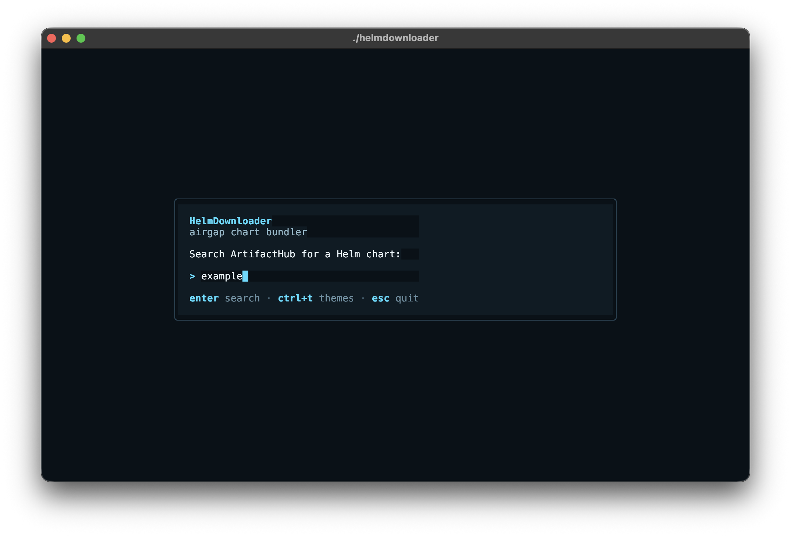

## Features

- **Search**: Search for Helm charts on [ArtifactHub](https://artifacthub.io)
- **Sort & filter**: Sort results by stars, name, or last-updated date, and filter by author or publishing company
- **Select**: Choose Helm charts and their versions (official / deprecated badges; stars, repo, publisher, app on each row)
- **Auto-discover**: Automatically extract all container image references from a rendered chart and its `values.yaml`, including the split `registry`/`repository`/`tag`/`digest` form used by many charts
- **Review**: Manually add, remove, or toggle individual images before downloading (windowed list for large charts; image refs validated on add)
- **Chart-only bundles**: Charts that ship no container images (e.g. CRD-only charts) bundle the chart alone — press `Enter` on the empty review screen to skip the download step
- **Download**: Daemonless image pulling using [go-containerregistry](https://github.com/google/go-containerregistry) (no Docker required); per-image progress; Esc cancels busy work while keeping partial successes
- **Archive**: Create a single compressed bundle per chart (`.tar.gz` or `.tar.zst`) with chart, values, retagged image tarballs, pinned digests, SPDX SBOM, checksums, and `load.sh`
- **Integrity**: `verify` and `diff` subcommands; `load.sh` checks `sha256sums.txt` (including itself) before load/push
- **Security review**: Export the discovered image list as JSON, hand it to a security team, re-import the approved set
- **Private registries**: Authenticated pulls via the default Docker keychain (`-registry-auth`)
- **Themes**: `auto`, `light`, `dark`, `high-contrast`, `ocean`, `matrix` — set with `-theme` or pick live with `Ctrl+T`
- **Resumable**: `-resume` reuses tarballs in a persistent work dir when content-hash and registry digest sidecars match

### Screenshots

Search:


Results:

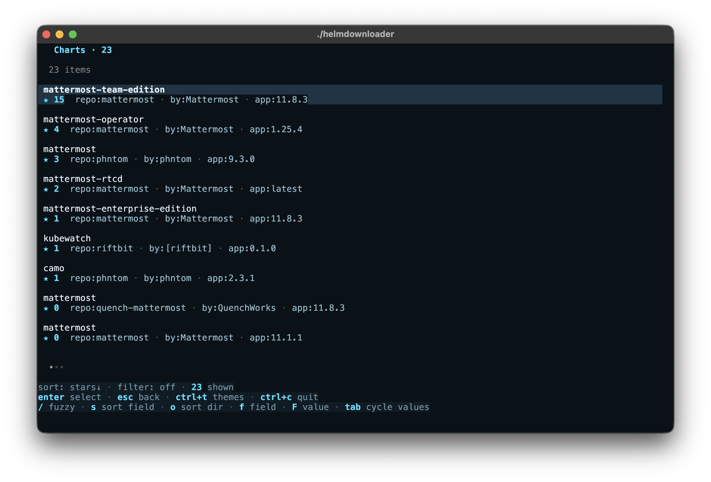

Versions:

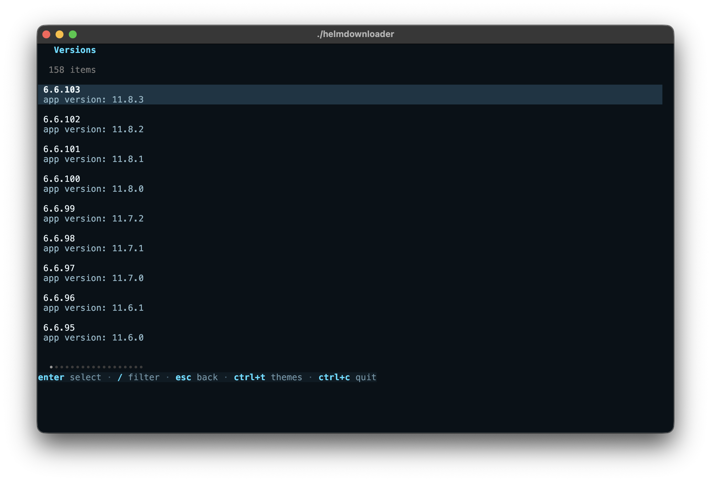

Review images:

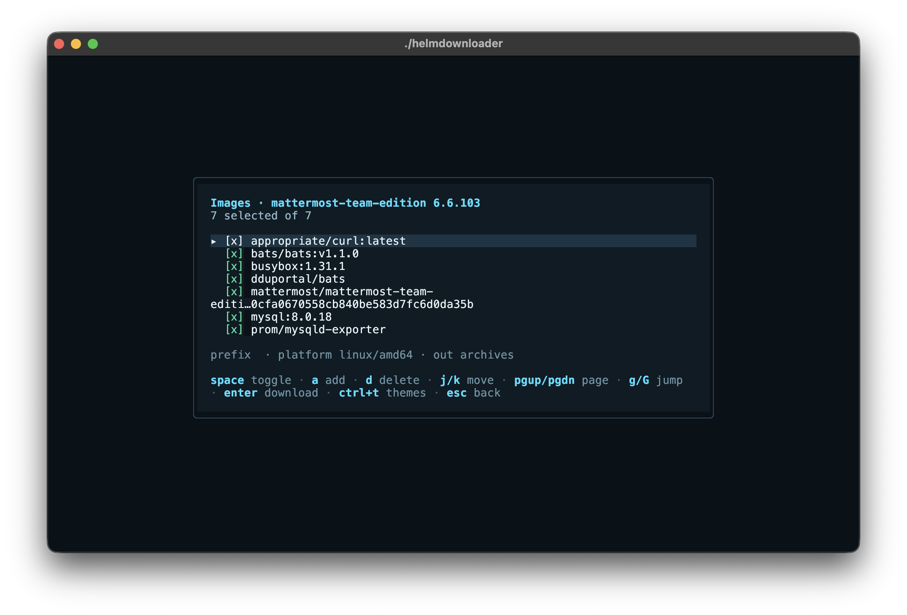

Download:

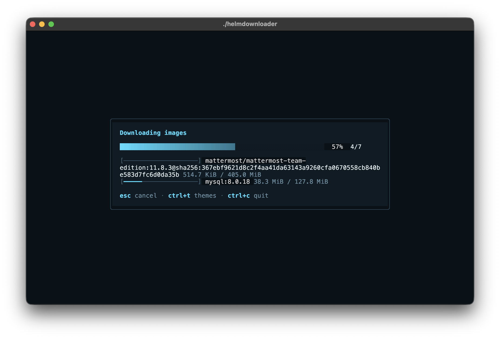

Done:

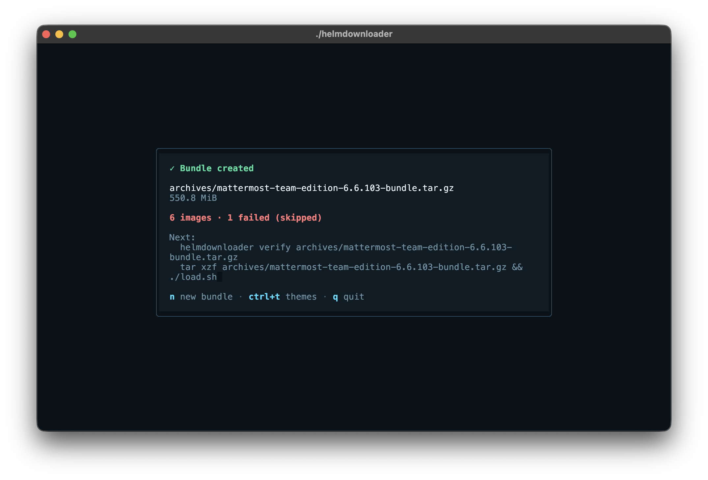

### Themes

| Light | Dark | High contrast | Ocean | Matrix |
| ----- | ---- | ------------- | ----- | ------ |
| 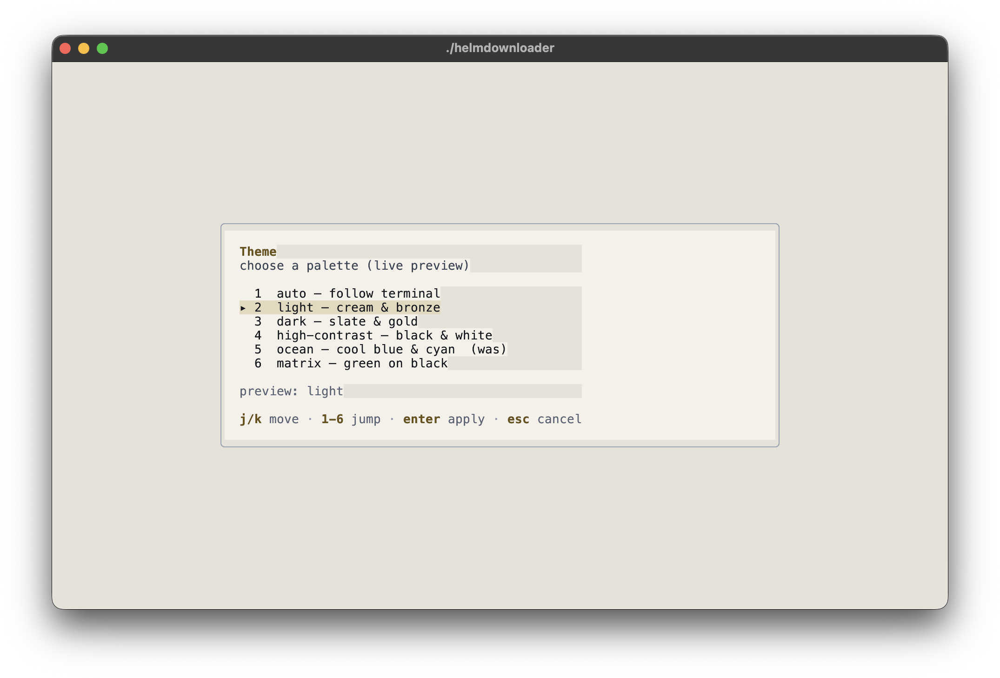 | 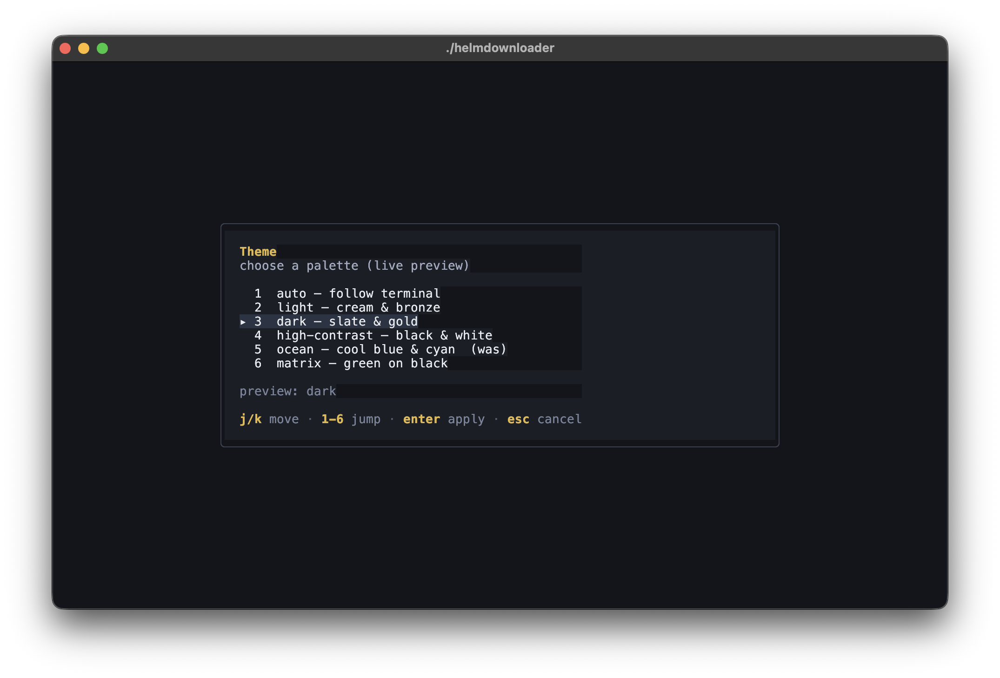 | 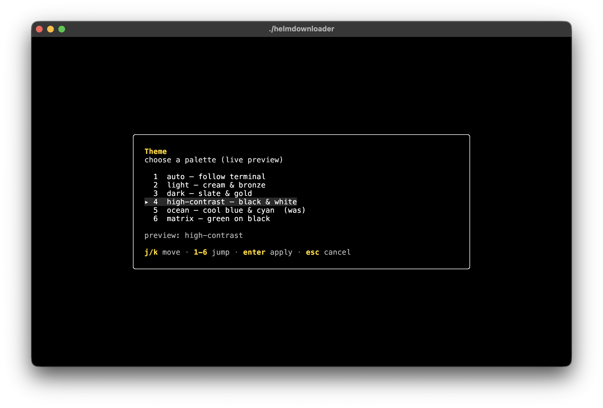 | 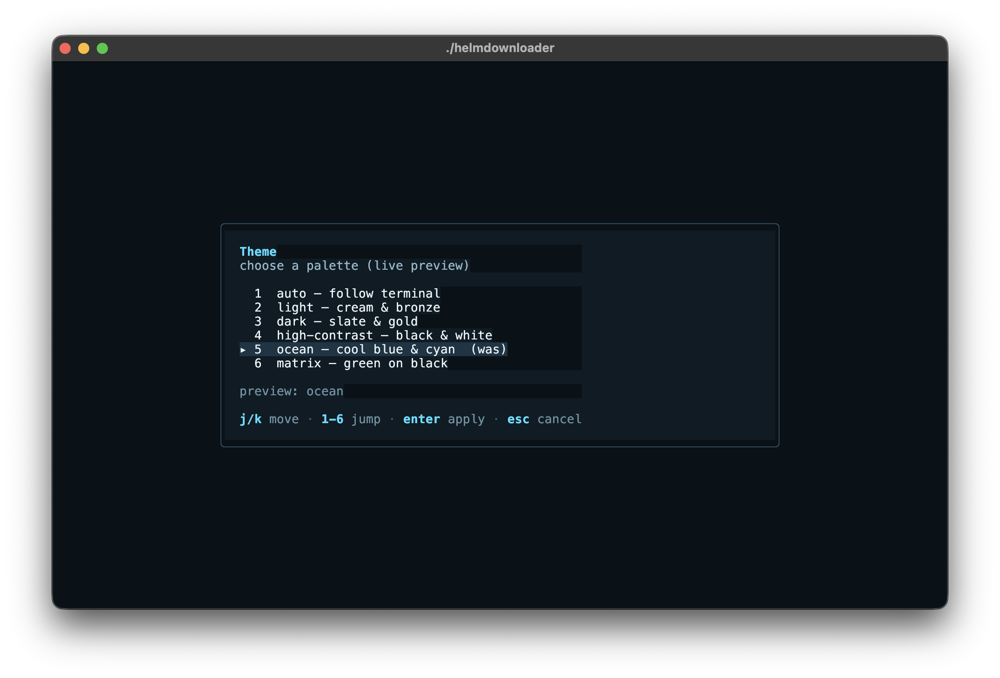 | 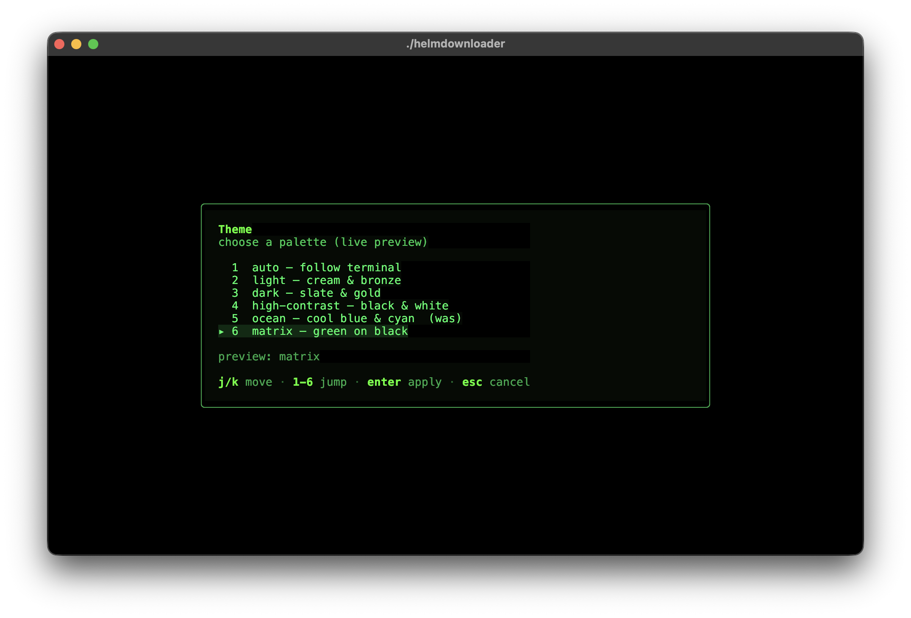 |

## Prerequisites

[Helm](https://helm.sh/docs/intro/install/) must be installed and on your `PATH` (or set `helm_bin` in the config). It is used to pull and render charts; image pulling itself is daemonless and needs no Docker. helmdownloader checks for a working helm at startup and exits with a clear message if it is missing.

Chart pulls are **hermetic**: each `helm pull` runs against a private repository config and cache scoped to the work directory, so the tool never reads your global `~/.config/helm/repositories.yaml`. A stale or removed entry there cannot break an unrelated pull with `Error: no cached repo found. (try 'helm repo update')` — and you don't need to run `helm repo update` beforehand.

## Installation

```bash
go install github.com/julienhmmt/helmdownloader@latest
```

Or build from source:

```bash
git clone https://github.com/julienhmmt/helmdownloader.git
cd helmdownloader
go build -o helmdownloader .
```

## Usage

### Quick Start

```bash
./helmdownloader
```

The TUI starts in a search screen. Type a chart name (e.g. `argo-cd`), press `Enter`, then navigate through the results to select a chart and version.

To bundle several charts in one sitting, press `a` (add another chart) on the Done screen: it returns to search while keeping the list of bundles already created. Each chart produces its own bundle. For fully headless multi-chart runs (a YAML list, no TUI), use the [`batch`](#batch) subcommand instead.

### Screens

| Screen | Keys | Description |
| ------ | ---- | ------------ |
| Search | `Enter` to search, `Ctrl+T` themes, `Esc` to quit | Type a chart name to search ArtifactHub |
| Results | `Enter` select, `/` fuzzy, `s` sort field, `o` sort dir, `f` field, `F` value, `Tab` cycle values, `Ctrl+T` themes, `Esc` back | Browse matching charts; official/deprecated badges on title; meta line shows stars, repo, publisher, app |
| Filter | `Enter` apply, `Tab` cycle values, `Ctrl+T` themes, `Esc` cancel | Type a substring to filter by author or company |
| Versions | `Enter` to select, `/` to filter, `Ctrl+T` themes, `Esc` to back | Pick a chart version |
| Review | `Space` toggle, `a` add, `d` delete, `j`/`k` move, `PgUp`/`PgDn` (or `Ctrl+u`/`Ctrl+d`) page, `g`/`G` jump, `Enter` download, `Ctrl+T` themes, `Esc` back | Review auto-discovered images; long lists are windowed |
| Add Image | `Enter` confirm, `Ctrl+T` themes, `Esc` cancel | Manually add an image reference |
| Download | `Esc` cancel (back to review or partial results), `Ctrl+T` themes, `Ctrl+C` quit | Pulls images; partial successes are kept |
| Done | `a` add another chart, `n` new session, `Ctrl+T` themes, `q` quit | Path, image counts, size, and next steps (`verify` / extract). `a` chains another chart into the same session; each chart still ships its own bundle and all session bundles are listed here |
| Theme | `j`/`k` move, `1`–`6` jump, `Enter` apply, `Esc` cancel | Pick a palette with live preview (`Ctrl+T` from most screens) |

### Sorting and Filtering Results

The results screen has two independent ways to narrow a long list of charts:

- `/` fuzzy filter — the built-in list filter, matching against chart name, repo, author, and organization.
- Structured sort/filter — driven by ArtifactHub metadata, shown on the status line above the footer:
  - `s` cycles the sort field: **stars → name → updated → stars**.
  - `o` toggles the sort direction (`↑` ascending / `↓` descending). Default is **stars, descending**.
  - `f` cycles the filter field: **off → author → company → off**.
  - `F` opens a substring input to type a filter value by hand.
  - `Tab` cycles through the distinct author/company values present in the current results.

The status line reports the active `sort:`, `filter:`, and the count of charts shown. Sorting and filtering happen entirely on the already-fetched results — no extra ArtifactHub queries.

### CLI Flags

```bash
./helmdownloader \
  -registry-prefix "my.registry.local" \
  -platform "linux/amd64" \
  -output "./archives" \
  -work-dir "./workdir" \
  -proxy "http://proxy.domain.local:3128" \
  -v \
  -log-level "debug" \
  -log-file "helmdownloader.log"
```

| Flag | Default | Description |
| ------ | ------- | ----------- |
| `-config` | `~/.config/helmdownloader/config.yaml` | Path to config file |
| `-values` | (none) | Extra values file layered onto the chart when rendering for image discovery (repeatable) |
| `-set` | (none) | Values override `key=value` for image discovery, e.g. `monitoring.enabled=true` (repeatable) |
| `-registry-prefix` | (from config) | Private registry prefix for retagging |
| `-platform` | (from config) | Target platform for images, e.g. `linux/amd64` |
| `-output` | (from config) | Output directory for bundles (default: archives) |
| `-work-dir` | (from config) | Work directory for intermediate files (charts, images). If empty, a temporary directory is used |
| `-temp-dir` | (from config) | Parent directory for temporary work directories. If not writable, a fallback is chosen and a warning printed |
| `-resume` | `false` | Reuse image tarballs already present in a persistent work dir instead of re-pulling (use with `-work-dir`). Reuse requires matching content-hash (`.sha256`) and registry digest (`.digest`) sidecars from a prior successful pull; truncated/corrupt tarballs and older work dirs without content hashes re-pull safely |
| `-registry-auth` | `false` | Enable authenticated pulls from private registries using the default Docker keychain |
| `-compression` | `gzip` | Bundle compression codec: `gzip` (`.tar.gz`) or `zstd` (`.tar.zst`, smaller) |
| `-min-free-mb` | `500` | Minimum free disk space (MiB) required on the work dir before downloading; `0` disables the check |
| `-concurrency` | `4` | Maximum number of images downloaded in parallel |
| `-retries` | `2` | Retry attempts per failed image pull (exponential backoff) |
| `-proxy` | (from config) | Proxy URL for ArtifactHub search, helm chart pulls, and registry image pulls (e.g. `http://proxy.domain.local:3128`) |
| `-v` | `false` | Enable verbose logging (shortcut for `--log-level=debug`) |
| `-log-level` | `info` | Set log level: `silent`, `info`, or `debug` |
| `-log-file` | `helmdownloader.log` | Path for log output |
| `-export-images` | (none) | Write the discovered image list (JSON) to this path after rendering, for security review |
| `-import-images` | (none) | Read an approved image list (JSON) from this path when entering the Review screen, overriding the discovered set |
| `-theme` | `auto` | TUI theme: `auto` (follow terminal), `light`, `dark`, `high-contrast`, `ocean`, or `matrix`. Named themes set a matching terminal background. Press `Ctrl+T` in the TUI to open the theme menu |

### Configuration File

Create `~/.config/helmdownloader/config.yaml` (or pass `-config /path/to/file`).
That path is preferred on all platforms. If it is missing, helmdownloader also
looks at the OS config dir (on macOS: `~/Library/Application Support/helmdownloader/config.yaml`).
A full annotated copy of every option lives in [`config.example.yaml`](./config.example.yaml):

```bash
mkdir -p ~/.config/helmdownloader
cp config.example.yaml ~/.config/helmdownloader/config.yaml
```

Minimal example:

```yaml
registry_prefix: "rgy01.domain.local"
platform: "linux/amd64"
output_dir: "archives"
work_dir: ""
temp_dir: ""              # system temp dir (e.g. /tmp); checked for write permissions at startup
concurrency: 4
retries: 2
compression: "gzip"          # gzip (.tar.gz) or zstd (.tar.zst, smaller)
min_free_disk_mb: 500        # free space required on work dir; 0 disables
resume: false                # reuse tarballs already in a persistent work_dir
https_proxy: "http://proxy.domain.local:3128"
helm_bin: "helm"
artifacthub_url: "https://artifacthub.io"
search_limit: 20
theme: "auto"                # auto | light | dark | high-contrast | ocean | matrix
registry_auth: false
values_files: []
set_values: []
export_images: ""
import_images: ""
verbose: true
log_level: "debug"
log_file: "helmdownloader.log"
```

CLI flags override the config file when set. Unset YAML fields keep built-in
defaults. See `config.example.yaml` for field-by-field documentation, defaults,
and the export/import security-review keys.

### Security Review Workflow

Use `-export-images` and `-import-images` to review the discovered image list with a security team before pulling:

```bash
# 1. Run with -export-images: discover images, write the list, then quit
#    from the Review screen (Esc) without downloading.
./helmdownloader -export-images images.json

# 2. Security team reviews/edits images.json (set selected: true/false,
#    remove untrusted refs, add missing ones).

# 3. Run with -import-images: the approved list overrides the discovered
#    set when the Review screen opens (you can still toggle/edit before Enter).
./helmdownloader -import-images images.json
```

Import rejects invalid image references with a non-zero error when entering Review so a bad edit fails closed at load time rather than after pull retries.

The JSON format is an array of entries:

```json
[
  {"ref": "quay.io/argoproj/argocd:v3.2.6", "selected": true},
  {"ref": "redis:7", "selected": false}
]
```

### Pulling from private registries

Use `-registry-auth` to pull images from private registries. The tool uses the default Docker keychain, so log in first with `docker login` (or `podman login`):

```bash
docker login registry.example.com
./helmdownloader -registry-auth -registry-prefix registry.example.com/mirror
```

To use a non-default credentials file, set the `DOCKER_CONFIG` environment variable to the directory containing `config.json`:

```bash
DOCKER_CONFIG=/path/to/creds ./helmdownloader -registry-auth
```

### Subcommands

#### version

```bash
./helmdownloader version
```

Prints the tool identity (`helmdownloader <version>`). Release builds inject the tag via ldflags; development builds report `dev` (or `git describe` when built with `make build`).

#### verify

```bash
./helmdownloader verify argo-cd-1.0.0-bundle.tar.gz
```

Checks bundle integrity without contacting any registry: re-hashes every file listed in `sha256sums.txt` (including `load.sh`) and confirms `manifest.json` is well-formed with a non-empty digest for every image. Exits 0 if intact, 1 on any mismatch, 2 on bad usage. Use this on the airgapped side after transfer, before running `load.sh`.

#### diff

```bash
./helmdownloader diff argo-cd-1.8.0-bundle.tar.gz argo-cd-1.9.0-bundle.tar.gz
```

Compares the image sets of two bundles by source reference and pinned digest, printing `+` added, `-` removed, and `~` changed (with old → new digest). Use this to see exactly what to re-mirror when updating a chart version in an airgapped environment.

#### batch

```bash
./helmdownloader batch charts.yaml
./helmdownloader batch -config /path/to/config.yaml charts.yaml
```

Downloads a whole list of charts headlessly — no TUI — so helmdownloader can run
unattended (CI, cron). Give it a YAML list of ArtifactHub `repo/name` charts:

```yaml
charts:
  - chart: bitnami/nginx
    version: 15.1.0          # optional; omit for the latest published version
  - chart: prometheus-community/kube-prometheus-stack
```

For each chart it resolves the version, pulls and renders the chart, downloads
**every** discovered image (headless mode has no interactive image review), and
writes a bundle — the same pipeline the TUI drives. All other settings
(registry prefix, output dir, platform, concurrency, compression, proxy,
`resume`, `registry_auth`, …) come from the [config file](#configuration-file);
only `-config` is accepted as a flag.

Output is one line per chart plus a final summary:

```text
[1/2] bitnami/nginx@15.1.0 ... ok -> archives/nginx-15.1.0-bundle.tar.gz
[2/2] prometheus-community/kube-prometheus-stack ... ok -> archives/kube-prometheus-stack-77.11.0-bundle.tar.gz
2/2 chart(s) succeeded
```

A single chart failure is reported (`FAILED: <reason>`) and the batch continues;
if a chart's images partially fail, the bundle still ships the images that
succeeded and the line notes how many failed. Exit code is 0 only when every
chart succeeded, non-zero otherwise — so CI fails loudly. See
[`charts.example.yaml`](./charts.example.yaml) for a starting point.

## Bundle Format

Each bundle is a `.tar.gz` (or `.tar.zst` with `-compression zstd`) named `<chart>-<version>-bundle.tar.gz` containing:

```text
<chart>-<version>.tgz     # the Helm chart
values.yaml               # default chart values
images/
  <image1>.tar            # retagged image tarball
  <image2>.tar
images.txt                # manifest: source_ref  dest_ref  tar_name  digest
manifest.json             # provenance: tool, toolVersion, chart, codec, images + digests
sbom.spdx.json            # SPDX 2.3 SBOM: chart + images with pinned digests
sha256sums.txt            # sha256 of every payload file including load.sh (sha256sum -c format)
load.sh                   # verifies checksums, then loads and pushes every image
```

The `images.txt` manifest maps original references to their retagged counterparts and records the resolved manifest digest (`sha256:...`, or `-` when the registry reported none) of exactly what was bundled, making it easy to script and verify the import side on airgapped infrastructure.

An SPDX 2.3 JSON SBOM (`sbom.spdx.json`) lists the chart and every image with its pinned manifest digest, for ingestion into standard SBOM tooling on the airgapped side.

On the airgapped side, extract the bundle and run the generated `load.sh` to load every image into your container engine and push it to the target registry:

```bash
tar xzf argo-cd-1.0.0-bundle.tar.gz
./load.sh                  # verifies checksums, then loads + pushes (docker by default)
ENGINE=podman ./load.sh    # use podman instead
DRY_RUN=1 ./load.sh        # print load/push commands without running them
```

`load.sh` verifies `sha256sums.txt` (which covers all payload files including `load.sh` itself) before touching the registry, aborts if neither `sha256sum` nor `shasum` is available, skips loading any image already present locally (idempotent re-runs), and honors `DRY_RUN=1` for a no-op preview.

## Architecture

```text
┌──────────────┐    ┌───────────────┐    ┌─────────────┐
│   Search     │───>│   Versions    │───>│   Review    │
│  (TUI)       │    │   (TUI)       │    │   (TUI)     │
└──────────────┘    └───────────────┘    └──────┬──────┘
                                                  │
                           ┌──────────────────────┘
                           ▼
              ┌─────────────────────────────┐
              │  helm pull + helm template    │
              │  -> auto-extract images       │
              └──────────────┬────────────────┘
                             │
              ┌──────────────▼──────────────┐
              │  go-containerregistry       │
              │  pull (pinned platform)     │
              │  save as docker tarball     │
              └──────────────┬──────────────┘
                             │
              ┌──────────────▼──────────────┐
              │  bundle as .tar.gz / .tar.zst│
              │  + SBOM + checksums + load.sh│
              └─────────────────────────────┘
```

### Packages

| Package | Responsibility |
| ------- | -------------- |
| `pkg/config` | YAML config loading with defaults |
| `pkg/artifacthub` | ArtifactHub REST API client (search, versions; respects proxy) |
| `pkg/helm` | Shell-outs to `helm` binary (pull, template, show values; hermetic repo/cache per work dir) |
| `pkg/images` | Parse rendered YAML manifests to extract `image:` references; retag with registry prefix; validate refs |
| `pkg/registry` | Daemonless image pull and save via `go-containerregistry` (byte progress, content-hash sidecars) |
| `pkg/bundle` | Assemble chart + values + image tarballs; `load.sh`, `sha256sums.txt`, `manifest.json`, SPDX SBOM; verify/diff |
| `pkg/pipeline` | Orchestrate Prepare → Download → Bundle with retries, concurrency, disk preflight, resume |
| `pkg/log` | Leveled logger (silent/info/debug) writing to the log file (mode 0600) |
| `pkg/version` | Build-time identity injected via ldflags / `git describe` |
| `internal/tui` | Bubble Tea terminal UI: screens, themes, progress, empty states |

## Image Discovery

Helm charts often declare images inside templates using `.Values.image.repository` and `.Values.image.tag`. To discover them, HelmDownloader renders the chart with default values using `helm template`, then recursively scans every YAML document for keys named `image`.

This means:

- ✅ Images in Deployments, StatefulSets, DaemonSets, Jobs, CronJobs, etc. are found
- ✅ Images in initContainers are found
- ✅ Sidecar images are found
- ✅ Subchart images are found — every bundled `charts/*/values.yaml` is scanned, catching split-form images for components disabled by default
- ⚠️ Images behind conditional logic (e.g. `{{- if .Values.monitoring.enabled }}`) may be missed if the condition is false with default values

To surface conditional images at render time, pass extra values with `-values myvalues.yaml` or `-set monitoring.enabled=true` (both repeatable). These only widen discovery; the bundle still ships the chart's default `values.yaml`.

You can always manually add missing images using the `a` key on the Review screen.

## Requirements

- [Go](https://go.dev) 1.26.5+ (to build; `toolchain go1.26.5` in `go.mod` for stdlib CVE fixes)
- [Helm](https://helm.sh) 3.x (runtime dependency, must be in `$PATH`)
- Network access to ArtifactHub and the chart/image registries

## License

GNU AGPL v3 — see [LICENSE](LICENSE)
